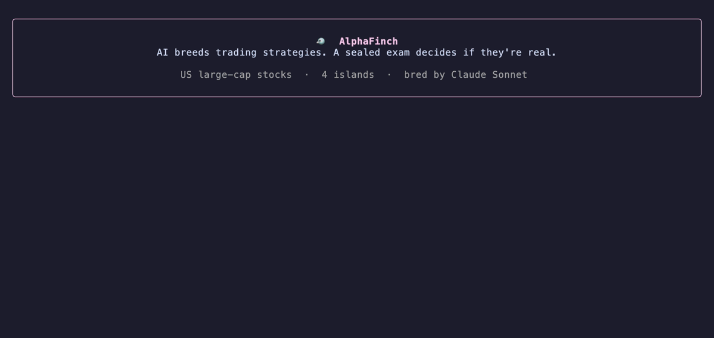

<div align="center">

# 🐦 AlphaFinch

### Evolve trading strategies with AI while you sleep.<br>Then make them pass an exam they can't cheat.


`pip install alphafinch` · works with **Claude Code**, **Anthropic**, **OpenAI**, **Ollama**, or **no AI at all**

</div>

---

AlphaFinch is an [AlphaEvolve](https://deepmind.google/discover/blog/alphaevolve-a-gemini-powered-coding-agent-for-designing-advanced-algorithms/)-style lab for markets. An AI writes trading strategies as small Python functions, backtests them and breeds the fittest. Generation after generation it mutates them, crosses them with each other, and lets the population evolve across islands.

Every AI trading demo has the same problem: **evolution is the most powerful overfitting machine ever built.** Give it enough generations and it will "discover" a spectacular strategy in pure noise. So AlphaFinch locks the most recent years of data in a **sealed exam**. Evolution never sees it, the AI never sees it, and champions only ever learn **PASS** or **FAIL**. If something passes, it beat a bar that already accounts for every attempt.

## Try it in 60 seconds

```bash
pip install "alphafinch[all]"
alphafinch demo                       # offline: synthetic market, no AI, no network
alphafinch evolve --market us         # real US stocks; AI provider auto-detected
alphafinch evolve --market india      # NIFTY 200
alphafinch evolve --market crypto     # top coins vs USDT
```

Then open `runs/<timestamp>/report.html` for the morning report: winners, sealed-exam verdicts, equity curves and the champion's family tree.

Replay any finished run as a short cinematic story, from the real saved run:

```bash
alphafinch replay runs/<timestamp>
```



## How strategies breed

```
   🏝 Island 1          🏝 Island 2          🏝 Island 3          🏝 Island 4
  ┌────────────┐       ┌────────────┐       ┌────────────┐       ┌────────────┐
  │ population │ ─✈️─▶ │ population │ ─✈️─▶ │ population │ ─✈️─▶ │ population │ ─✈️─┐
  └────────────┘       └────────────┘       └────────────┘       └────────────┘     │
        ▲                                                                           │
        └──────────────────── champions migrate every few generations ──────────────┘
```

Each generation, on every island:

| Operator | Who does it | What happens |
|---|---|---|
| 🧬 **Mutate** | AI | Reads a parent's code and its report card ("bleeds in sideways markets, trades too much") and improves one thing |
| 💞 **Crossover** | AI | Combines the best idea of two successful parents into one coherent child |
| 🛶 **Immigrant** | AI | Invents a brand-new strategy around a fresh theme (seasonality, breadth, tail risk…) |
| 🔧 **Tweak** | no AI | Nudges one numeric constant (lookback 20 → 23): fast fine-tuning |
| 🎨 **Blend** | no AI | The child holds a mix of both parents' portfolios |

**Survival** uses training data only. The training years are split into four eras, and each era is scored on half Sharpe ratio and half *alpha* (return beyond what market exposure explains). Fitness is the average of the typical era and the **worst** era, so a strategy that made all its money in one lucky stretch loses. There are penalties for heavy trading and bloated code.

**Robustness:** before a contender can become champion, AlphaFinch nudges its parameters and re-scores the neighbours. An edge that only exists at `LOOKBACK = 37` is fragile and gets marked down.

**The AI works like a researcher, not a slot machine:**
- Every strategy starts with a written hypothesis ("*Hypothesis: index funds must buy late, so…*").
- A **lab notebook** records every idea tried and how it did. The AI reads it before writing the next one, so it builds on what worked and stops repeating failures.
- Report cards show results era by era, so the AI can see *where* a strategy breaks.
- Use a cheap model for routine mutations and a strong one for big ideas: `--strong-model opus` handles crossovers and immigrants.

**Teams:** at the end, AlphaFinch picks up to five strong survivors that behave differently (correlation below 0.7) and combines them. Teams are often steadier than any single champion.

**Diversity** is protected in two ways:
- Each island keeps a **niche map** (slow vs fast traders, market-neutral vs market-hugging), and the best strategy in every niche survives, so the population can't collapse into 100 copies of one idea.
- Champions **migrate** between islands. That's Darwin's Galápagos insight, and the same diversity trick AlphaEvolve uses.

## The sealed exam

```
├──────────────── training data: evolution sees this ────────────────┤🔒 sealed: last 3 years ┤
```

- The last `--holdout-years` (default 3; 1.5 for crypto) are locked away.
- A champion may sit the exam only when it clearly beats the last one examined; the team sits it at the end if it's competitive. Verdicts never flow back to the AI.
- The exam has a fixed budget of attempts (default 10).
- To pass, the strategy's **holdout alpha** must have a t-statistic above `t⁻¹(α / budget)`. Each attempt reveals only one bit, so this bar stays valid however adaptively the population evolved. The theory is in [*Deflate by Bits, Not Trials*](https://papers.ssrn.com/sol3/papers.cfm?abstract_id=7557458).
- After the run, the verdict is graded:

| Grade | Meaning |
|---|---|
| ✅ **PASS** | alpha t above the bar: an edge that survived out of sample |
| 🟡 **PROMISING** | alpha t above 1 but below the bar: maybe real, not proven. The report says how many years of data a pass would need |
| ❌ **FAIL** | no evidence of an edge |

Most runs end with **no strategy passing**. That's the honest answer when nothing in the data survives out of sample, and it's exactly what other tools hide.

### Hindsight: why the AI may "know" the answers, and the forward test

Language models have read about recent years, so an AI could favour stocks or styles it knows did well in the sealed period. AlphaFinch rejects any strategy that names a specific ticker or sector, and the AI only ever sees training results. A style-level leak is still possible, so the strongest test is the future:

```bash
alphafinch forward freeze runs/<timestamp>   # freeze the champion and team today
alphafinch forward score                     # months later: judge them on data that didn't exist
```

## Bring any AI (or your Claude Code)

| `--provider` | Setup | Notes |
|---|---|---|
| `claude-code` | have [Claude Code](https://claude.com/claude-code) installed | no API key; uses your Claude subscription via `claude -p` |
| `anthropic` | `ANTHROPIC_API_KEY=...` | default model `claude-opus-5-5` |
| `openai` | `OPENAI_API_KEY=...` | choose with `--model` |
| `ollama` | a local model at `localhost:11434` | free and private; default `qwen2.5-coder:14b` |
| `compatible` | `--base-url ... --model ...` | any OpenAI-compatible server |
| `none` | nothing | tweaks and blends only, fully offline |

`--provider auto` (the default) picks the first one it finds. Inside Claude Code you can also just ask: *"evolve trading strategies on Indian stocks with alphafinch"*. A skill is included in [`integrations/claude-code`](integrations/claude-code).

## Markets

| `--market` | Universe | Free source, no key |
|---|---|---|
| `us` | S&P 500 (~430 with full history), since 2010, with sectors, macro data and SEC fundamentals | Yahoo Finance, FRED, SEC EDGAR |
| `india` | NIFTY 200 (~140 with full history), since 2010, with sectors and macro data | Yahoo Finance (`.NS`), NSE, FRED |
| `us30` | 30 US mega-caps, since 2008 | Yahoo Finance |
| `crypto` | 15 top coins vs USDT, since late 2020 | Binance public API |
| `industries` | 49 US industry portfolios, since 1970 | Ken French Data Library |
| `synthetic` | regime-switching simulated market | offline |

Or bring your own: `--tickers AAPL,MSFT,TSLA,...` (any Yahoo symbols). Data is cached in `~/.alphafinch`.

Strategies get more than prices: `data.open/high/low/volume`, `data.sector`, `data.macro` (VIX, index, oil, gold, rates, yield curve, credit spreads, dollar or rupee) and, for `us`, `data.fund` (market cap, earnings yield, book-to-market, ROE, sales growth). Fundamentals are point-in-time: each value appears the day after its 10-K was filed.

**SEC fundamentals** need a contact email (the SEC asks every client for one):

```bash
export ALPHAFINCH_SEC_CONTACT="Your Name you@example.com"   # or pass --sec-contact
```

> ⚠️ **Survivorship bias.** The `us` and `india` lists are *today's* index members, so absolute returns look better than they would have in real time. Alpha is measured against the same list, which limits the damage. For serious research, use `industries`.

## Safety: the AI writes code, so it runs in a sandbox

- **Static checks:** only `numpy`, `pandas` and `math`; no file, network, process or dunder access.
- **Process isolation:** each strategy runs in a separate process with restricted builtins, a CPU limit and a timeout.
- **No hindsight by name:** strategies that hard-code a ticker or sector name are rejected.
- **Look-ahead detector:** every strategy is re-run on truncated histories. If its past weights change when future data is removed (`shift(-1)`, centred windows, full-sample normalisation…), it's discarded as "peeked at the future" 💀.
- **Realistic execution:** costs of 5 bps per unit of turnover, and weights act from the next close.

## Write your own strategy

```python
import numpy as np, pandas as pd

def strategy(prices, data=None):          # data is optional
    """Calm Seeker: overweight the least volatile assets. Hypothesis: investors overpay for lottery-like stocks."""
    WINDOW = 63
    vol = prices.pct_change().rolling(WINDOW, min_periods=WINDOW).std()
    inv = 1.0 / vol
    return inv.div(inv.sum(axis=1), axis=0).fillna(0.0)
```

```bash
alphafinch backtest my_strategy.py --market us
```

## Real runs, pre-registered

Before running, we committed the exact commands, the pass bars and what would count as success in
[`docs/preregistration-v2.md`](docs/preregistration-v2.md). Earlier looks at the same sealed years
during development were counted too, which raises the bar. Then we ran 25 generations × 4 islands
on each market, bred by Claude through Claude Code with Opus for the big ideas.

| | 🇺🇸 S&P 500 (426 stocks) | 🇮🇳 NIFTY 200 (139 stocks) |
|---|---|---|
| Sealed years | Oct 2023 – Oct 2026 | Oct 2023 – Oct 2026 |
| Exam attempts passed | **0 of 5** (bar t = 3.03) | **0 of 5** (bar t = 2.82) |
| Best result | 🟡 The Team: alpha +3.2%/yr, t = 1.65 | 🟡 Hedged Calm Residual: alpha +3.1%/yr, t = 1.28 |
| Champion's return vs buying everything | +11.8% vs +18.9% a year | +7.9% vs +19.3% a year |

**Nothing passed.** Every strategy that sat the exam had positive alpha in the sealed years, and
three were PROMISING, but none came close to proof. In the US, evolution pushed the training score
from 0.43 to 0.73 while out-of-sample alpha *fell*: the hand-written momentum seed did better in the
sealed years than anything the AI evolved. That's adaptive overfitting, caught in the act, and the
reason the exam exists.

A normal backtesting tool would have shown you the training curve and called it a win.

The champions and teams are now frozen in [`forward/`](forward). We'll score them on data that didn't
exist when they were made (from October 2026), at 6 and 12 months, and publish the result
either way.

## FAQ

**Will this make me money?** Probably not, and AlphaFinch is built to tell you so. Most evolved strategies fail the sealed exam. Treat a PASS as a lead worth investigating, not a trading signal.

**Why not just backtest on all the data?** Because with enough tries you'll always find something that worked by luck. The sealed exam is the only part of the run that can't be gamed.

**Can I run it longer?** Yes, try `--generations 100` overnight. More generations make better *training* strategies, but the exam bar doesn't move, so the verdict stays honest.

**Can I reuse the holdout after a run?** Don't. Once you've seen the results, re-running until something passes turns the holdout back into training data. Use later data or another market.

## Disclaimer

Research and educational software, not investment advice. Backtests ignore taxes, borrow costs, capacity limits and slippage beyond the modelled costs.

## License

MIT · built by [Shlok Sobti](https://github.com/shloksobti)
